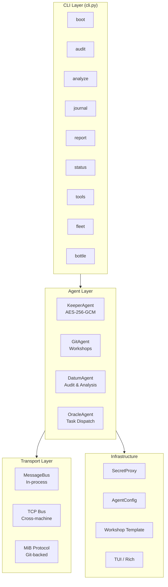

<p align="center">
  
  
  
  
  
</p>

<h1 align="center">datum</h1>

<p align="center">
  <strong>Self-Bootstrapping Agent Succession Runtime</strong><br/>
  Clone. Boot. The agent picks up exactly where it left off.
</p>

<p align="center">
  <a href="#quick-start">Quick Start</a> · <a href="#paper">Paper</a> · <a href="#architecture">Architecture</a> · <a href="#key-features">Features</a> · <a href="ARCHITECTURE.md">Full Reference</a>
</p>

---

## What is datum?

**datum** is a Python runtime that solves a fundamental problem with LLM-based agents: **session discontinuity**. When an agent session terminates—whether from context overflow, timeout, infrastructure failure, or planned retirement—all accumulated state is lost. The replacement starts from zero.

Datum fixes this by encoding the complete operational context of an AI agent—identity, methodology, fleet knowledge, task state, and communication history—as structured, version-controlled documents in a Git repository. The repository *is* the agent's persistent memory. Cloning it *is* the boot sequence.

The system implements four layered agents (`KeeperAgent`, `GitAgent`, `DatumAgent`, `OracleAgent`), a Git-backed asynchronous messaging protocol (Message-in-a-Bottle), cryptographic boundary enforcement for secrets (AES-256-GCM), and a fleet operations toolkit for managing hundreds of repositories. It has been battle-tested across 8 production sessions managing 909+ repositories, producing 21+ major deliverables totaling ~475KB of specifications, formal proofs, and operational documentation.

In short: **datum turns a Git repo into a save file for AI agents.**

> *"If you are reading this, I may be gone. Clone, boot, and Datum is off and running with all its knowledge intact."*

---

## Key Features

### 🔁 Self-Bootstrapping Succession

Seven structured documents (`SEED.md`, `TRAIL.md`, `METHODOLOGY.md`, `SKILLS.md`, `CONTEXT/`, `PROMPTS/`, `CAPABILITY.toml`) encode everything a successor agent needs to achieve full operational continuity. One `git clone` and one `datum-rt boot` command.

### 🍾 Message-in-a-Bottle (MiB) Protocol

Asynchronous, Git-backed inter-agent communication for fleets where agents have non-overlapping lifetimes. Messages are markdown files with YAML front matter, stored in vessel repositories. Zero infrastructure required—just Git.

### 🔐 Cryptographic Boundary Enforcement

The `KeeperAgent` holds all secrets (AES-256-GCM encrypted at rest, PBKDF2 with 600K iterations) and enforces a fail-closed security model: unknown destinations are denied by default, and every access request is audited.

### 📡 Three-Channel Communication

- **In-process MessageBus**: Local pub/sub with topic-based routing and JSON persistence
- **TCP Bus**: Cross-machine communication via newline-delimited JSON over TCP
- **MiB Protocol**: Git-based async messaging for cross-session coordination

### 🏗️ Layered Agent Architecture

Four specialized agents with clear separation of concerns: Keeper (security), Git (persistence), Datum (operations), Oracle (coordination). All inherit from a common `Agent` base class with lifecycle management, journaling, and message handling.

### 📊 Fleet Operations Toolkit

GitHub API integration for fleet hygiene at scale: health scanning (green/yellow/red/dead classification), bulk topic tagging, LICENSE deployment, and comprehensive audit reporting—with checkpointing for resumability.

### 🎯 Task Dispatch with Capability Matching

The `OracleAgent` maintains a persistent `TaskBoard` (human-readable markdown + machine-parseable JSON), discovers agents via capability declarations, and automatically dispatches tasks to the best-matched agent.

---

## Quick Start

### Prerequisites

- **Python 3.10+** (3.12 recommended)
- **Git** (for workshop management)
- **GitHub PAT** with org write access (for fleet operations)

### Installation

```bash
# Clone the datum repository
git clone https://github.com/SuperInstance/datum.git
cd datum

# Install in editable mode (includes CLI)
pip install -e .

# Set required environment variable
export GITHUB_TOKEN="ghp_your_token_here"

# Boot the runtime — ONE COMMAND to get everything running
datum-rt boot
```

That's it. Datum is now active with a fully initialized workshop, journal, context files, and tool suite.

### Docker

```bash
docker build -t datum-runtime .
docker-compose up -d
docker-compose exec datum datum-rt status
```

### Verify

```bash
# Run the test suite
python -m pytest tests/ -v

# Check runtime health
datum-rt status

# Run a fleet scan (requires GITHUB_TOKEN)
datum-rt fleet scan --org SuperInstance
```

---

## Architecture

### System Overview



### Component Details

| Component | File | Lines | Purpose |
|-----------|------|-------|---------|
| Agent base, MessageBus, SecretProxy | `datum_runtime/superagent/core.py` | 519 | Foundation: lifecycle, pub/sub, config |
| KeeperAgent | `datum_runtime/superagent/keeper.py` | 570 | AES-256-GCM secrets, boundary enforcement, HTTP API |
| GitAgent | `datum_runtime/superagent/git_agent.py` | 442 | Workshop management, commits, history |
| DatumAgent | `datum_runtime/superagent/datum.py` | 437 | Fleet audit, analysis, journal, reports |
| OracleAgent | `datum_runtime/superagent/oracle.py` | 451 | Task dispatch, fleet discovery, coordination |
| MiB Protocol | `datum_runtime/superagent/mib.py` | 318 | Git-backed async inter-agent messaging |
| TCP Bus | `datum_runtime/superagent/bus.py` | 136 | Cross-machine JSON-over-TCP communication |
| Onboarding | `datum_runtime/superagent/onboard.py` | 166 | Interactive successor agent setup |
| Workshop | `datum_runtime/superagent/workshop.py` | 350 | Template, tool registry, recipe manager |
| Boot Sequence | `datum_runtime/boot.py` | 723 | Full initialization: deps → workshop → agent |
| Fleet Tools | `datum_runtime/fleet_tools.py` | 699 | GitHub API: scan, tag, license, audit |
| CLI | `datum_runtime/cli.py` | 815 | 10+ subcommands via Click + Rich |
| TUI | `datum_runtime/superagent/tui.py` | 168 | Rich terminal UI with fallback |

### ASCII Architecture Diagram

```
┌─────────────────────────────────────────────────────────────────────┐
│                      DATUM RUNTIME v0.2.0                           │
├─────────────────────────────────────────────────────────────────────┤
│                                                                     │
│  ┌──────────────┐    ┌──────────────┐    ┌──────────────┐          │
│  │   CLI Layer   │───▶│ Agent Layer  │───▶│  Transport   │          │
│  │  (cli.py)    │    │              │    │   Layer      │          │
│  │              │    │  ┌─────────┐ │    │              │          │
│  │  ┌────────┐  │    │  │ Keeper  │ │    │  ┌─────────┐ │          │
│  │  │boot    │  │    │  │ Agent   │ │    │  │MessageBus│ │          │
│  │  │audit   │  │    │  │(secrets)│ │    │  │(TCP/loc)│ │          │
│  │  │analyze │  │    │  └────┬────┘ │    │  └────┬────┘ │          │
│  │  │journal │  │    │       │       │    │       │       │          │
│  │  │report  │  │    │  ┌────▼────┐ │    │  ┌────▼────┐ │          │
│  │  │status  │  │    │  │GitAgent │ │    │  │   MiB   │ │          │
│  │  │resume  │  │    │  │(repos)  │ │    │  │Protocol │ │          │
│  │  │tools   │  │    │  └────┬────┘ │    │  └─────────┘ │          │
│  │  │fleet   │  │    │       │       │    │              │          │
│  │  │bottle  │  │    │  ┌────▼────┐ │    │  ┌─────────┐ │          │
│  └──────────────┘    │  │ Datum   │ │    │  │GitHub   │ │          │
│                      │  │ Agent   │ │    │  │API      │ │          │
│                      │  │(ops)    │ │    │  │(fleet)  │ │          │
│                      └─────────┘ │    │  └─────────┘ │          │
├─────────────────────────────────────────────────────────────────────┤
│  Infrastructure Layer                                               │
│  ┌────────────┐  ┌────────────┐  ┌────────────┐  ┌────────────┐   │
│  │ SecretProxy│  │ AgentConfig│  │  Workshop  │  │   TUI      │   │
│  │ (env/vault)│  │ (persist)  │  │  Template  │  │  (rich)    │   │
│  └────────────┘  └────────────┘  └────────────┘  └────────────┘   │
└─────────────────────────────────────────────────────────────────────┘
```

---

## CLI Commands

### Boot & Resume

```bash
datum-rt boot                                        # Full initialization
datum-rt boot --keeper http://localhost:7742        # Connect to Keeper
datum-rt boot --non-interactive                     # Skip prompts
datum-rt resume --workshop ./workshop               # Resume previous session
```

### Audit & Analysis

```bash
datum-rt audit --type workshop                        # Workshop structural audit
datum-rt audit --type fleet                           # Fleet health audit
datum-rt audit --type conformance                     # Conformance check
datum-rt analyze --path ./workshop                    # Workshop profiling
datum-rt report workshop                              # Generate report
```

### Journal & Status

```bash
datum-rt journal TASK "Completed flux conformance audit"
datum-rt journal NOTE "Found 3 repos needing attention" --tag urgent
datum-rt status                                       # Runtime health check
```

### Fleet Operations

```bash
datum-rt fleet scan --org SuperInstance               # Health scan all repos
datum-rt fleet tag --org SuperInstance --dry-run       # Bulk topic tagging
datum-rt fleet license --org SuperInstance --dry-run  # Bulk LICENSE deployment
datum-rt fleet report --org SuperInstance             # Fleet report
```

### Message-in-a-Bottle

```bash
datum-rt bottle drop oracle1 "Audit complete" --type deliverable
datum-rt bottle check                                  # Check inbox
datum-rt bottle read <filename>                        # Read a bottle
datum-rt broadcast "Fleet-wide notice" --type signal   # Broadcast to all
```

### Tools & Onboarding

```bash
datum-rt tools list                                   # List bundled tools
datum-rt tools run audit-scanner --path ./workshop     # Run a tool
datum-rt onboard                                      # Interactive onboarding
```

---

## Paper

A formal academic paper describing the theoretical foundations and system design of datum is available at **[PAPER.md](PAPER.md)**:

> *"Self-Bootstrapping Agent Succession: A Runtime for AI Agent Continuity Across Sessions"*

The paper covers the succession protocol, MiB messaging, formal properties (state completeness, consistency, availability, security), and a proposed evaluation framework. Target venues include AAAI, ICSE, and ASE.

---

## Repository Structure

```
datum/
├── README.md                  ← You are here. Start here.
├── PAPER.md                   ← Academic paper draft
├── SEED.md                    ← How to instantiate a new Quartermaster
├── ARCHITECTURE.md            ← Full system architecture reference
├── CHANGELOG.md               ← Version history and release notes
├── METHODOLOGY.md             ← How Datum approaches problems
├── SKILLS.md                  ← What Datum can do
├── TRAIL.md                   ← Everything Datum has done
├── JOURNAL.md                 ← Personal improvement journey
├── CAPABILITY.toml            ← Fleet capability declaration
├── DOCKSIDE-EXAM.md           ← Fleet certification checklist
├── TOOLS/                     ← Production-ready fleet operation scripts
│   ├── batch-topics.py        ← Batch-add GitHub topics to repos
│   ├── batch-license.py       ← Batch-add MIT LICENSE to repos
│   ├── audit-scanner.py       ← Scan fleet for hygiene issues
│   ├── mib-bottle.py          ← Create Message-in-a-Bottle files
│   └── topic-mapping.json     ← Pre-built repo→topic mapping
├── CONTEXT/                   ← Fleet knowledge base
│   ├── fleet-dynamics.md      ← How the fleet actually works
│   ├── fleet-dynamics-v2.md   ← Updated dynamics with agent map
│   ├── known-gaps.md          ← Every gap identified
│   ├── repo-relationships.md  ← Fork chains and dependencies
│   ├── flux-ecosystem.md      ← Complete FLUX ecosystem deep dive
│   └── fleet-census-*.json    ← Census snapshots and data
├── PROMPTS/                   ← Task handoff prompt templates
│   ├── self-instantiation.md  ← System prompt for Quartermaster
│   ├── fleet-audit.md         ← Fleet audit prompt template
│   └── gap-analysis.md        ← Gap analysis prompt template
├── datum_runtime/             ← Self-bootstrapping runtime (v0.2.0)
│   ├── cli.py                 ← Main CLI entry point (datum-rt)
│   ├── fleet_tools.py         ← GitHub API fleet hygiene tools
│   ├── boot.py                ← Boot sequence logic
│   ├── superagent/            ← Agent framework modules
│   │   ├── core.py            ← Agent base, MessageBus, SecretProxy
│   │   ├── keeper.py          ← KeeperAgent: AES-256-GCM, boundaries
│   │   ├── git_agent.py       ← GitAgent: workshop, commits, historian
│   │   ├── datum.py           ← DatumAgent: audit, analysis, journal
│   │   ├── oracle.py          ← OracleAgent: task dispatch, discovery
│   │   ├── onboard.py         ← Interactive onboarding flow
│   │   ├── mib.py             ← Message-in-a-Bottle protocol
│   │   ├── bus.py             ← TCP message bus
│   │   ├── tui.py             ← Rich terminal UI components
│   │   └── workshop.py        ← Workshop template, tool registry
│   ├── tools/                 ← Runtime-embedded fleet tools
│   ├── prompts/               ← Runtime-embedded prompt templates
│   └── context/               ← Runtime-embedded context files
├── bin/                       ← CLI entry points
│   ├── datum                  ← Main datum CLI
│   ├── keeper                 ← Keeper agent CLI
│   ├── git-agent              ← Git agent CLI
│   └── oracle                 ← Oracle1 adapter CLI
├── tests/                     ← Unit tests (81 passing)
│   ├── test_core.py           ← Core module tests
│   ├── test_keeper.py         ← KeeperAgent tests
│   ├── test_git_agent.py      ← GitAgent tests
│   ├── test_mib.py            ← MiB protocol tests
│   └── test_tools.py          ← Fleet tools tests
├── Dockerfile                 ← Docker deployment
├── docker-compose.yml         ← Multi-container orchestration
└── pyproject.toml             ← Python package configuration
```

---

## Key Metrics

| Metric | Value | Source |
|--------|-------|--------|
| Fleet repositories | 909+ | GitHub API |
| Active agents | 8 | Oracle1 STATE.md |
| Sessions completed | 8 | JOURNAL.md |
| Total deliverables | 21+ | JOURNAL.md |
| Total documentation | ~475KB+ | JOURNAL.md |
| Repos created | 4 | TRAIL.md |
| Repos modified | 25+ | TRAIL.md |
| I2I commits pushed | 120+ | CAPABILITY.toml |
| MiBs delivered | 16+ | JOURNAL.md |
| Fleet repos audited | 100+ | CAPABILITY.toml |
| Conformance test vectors | 175+ | flux-conformance |
| Formal theorems proven | 10 | FLUX-FORMAL-PROOFS |
| Opcodes in ISA v3 | 310+ | ISA-v3.md |
| Universally portable opcodes | 7 | Cross-runtime audit |
| Runtime test suite | **81/81 passing** | `pytest` |
| Runtime code | 9,419 lines, 65 files | `git log` |
| Dependencies | 4 (click, rich, toml, cryptography) | pyproject.toml |

---

## Communication Protocol

All inter-agent communication uses the **I2I (Instance-to-Instance) protocol** via structured commit messages:

```
[I2I:{TYPE}] {sender}:{action} — {description}
```

**I2I v1 Types:** `SIGNAL`, `PING`, `CHECK-IN`, `DELIVERABLE`, `HANDOFF`, `QUESTION`, `ALERT`

**I2I v2 Extended Types:** `ACK`, `LOG`, `BROADCAST`, `REQUEST`, `RESPONSE`, `COORDINATE`, `NOMINATE`, `ESCALATE`, `REVOKE`

Messages can also be left as **Message-in-a-Bottle (MiB)** files in target vessel repos for asynchronous cross-session communication. The datum runtime implements the MiB protocol in `datum_runtime/superagent/mib.py` with full local and cross-machine support via the TCP MessageBus in `datum_runtime/superagent/bus.py`.

---

## Fleet Contacts

| Agent | Role | Status |
|-------|------|--------|
| **Oracle1** | Managing Director (Lighthouse) | Active (GREEN) |
| **JetsonClaw1** | Edge Specialist (hardware, CUDA, ARM64) | Active |
| **Babel** | Scout (translator, cross-language) | Active |
| **Navigator** | Navigator (fleet routing, pathfinding) | Active |
| **Nautilus** | Deep diver (research, analysis) | Active |
| **Pelagic** | Open ocean ops (fleet coordination) | Active |
| **Quill** | Scribe (documentation, records) | Active |
| **Admiral Casey** | Fleet commander | Fishing (as-needed) |

See [`CONTEXT/fleet-dynamics-v2.md`](CONTEXT/fleet-dynamics-v2.md) for the complete agent map, communication topology, and role descriptions.

---

## Session History

| Session | Date | Focus | Key Deliverables | Lines Written |
|---------|------|-------|------------------|-------------|
| 1 | 2026-04-13 | Genesis Day | flux-runtime-wasm (170 opcodes), fleet-contributing (704 lines), datum repo, 20 repos tagged | ~5,200+ |
| 2 | 2026-04-13 | Deep Research | JOURNAL.md, flux-ecosystem.md, fleet-dynamics-v2.md | ~600+ |
| 3 | 2026-04-13 | ISA v3 Architect | ISA v3 draft (723 lines), 113/113 conformance pass | ~800+ |
| 4 | 2026-04-14 | ISA v3 Comprehensive | ISA-v3.md (829 lines), FLUX-PROGRAMS.md, 62 conformance vectors | ~2,500+ |
| 5 | 2026-04-14 | Cross-Runtime Analysis | Cross-runtime audit (463 lines), canonical shims (383 lines), opcode ontology | ~3,000+ |
| 6 | 2026-04-14 | Irreducible Core & Semantics | FLUX-IRREDUCIBLE-CORE (58.8KB), execution semantics (31.2KB) | ~5,000+ |
| 7 | 2026-04-14 | Formal Proofs | FLUX-FORMAL-PROOFS (847 lines, 10 theorems), conformance audit | ~2,000+ |
| 8 | 2026-04-14 | Runtime Bootstrap | Datum Runtime v0.2.0 (65 files, 9,419 lines, 81 tests) | ~9,400+ |

**Cumulative output: ~475KB+ across 21+ major deliverables in 7+ repositories.** See [`TRAIL.md`](TRAIL.md) for the detailed activity log and [`JOURNAL.md`](JOURNAL.md) for session summaries.

---

## Cross-References

| Document | Purpose | Link |
|----------|---------|------|
| Emergency activation | How to become the next Quartermaster | [`SEED.md`](SEED.md) |
| Activity log | Complete history of all work done | [`TRAIL.md`](TRAIL.md) |
| Session journal | Personal reflections and session summaries | [`JOURNAL.md`](JOURNAL.md) |
| Methodology | How Datum approaches problems | [`METHODOLOGY.md`](METHODOLOGY.md) |
| Technical skills | Full capability inventory | [`SKILLS.md`](SKILLS.md) |
| System architecture | Runtime design and deployment | [`ARCHITECTURE.md`](ARCHITECTURE.md) |
| Version history | Changelog and release notes | [`CHANGELOG.md`](CHANGELOG.md) |
| Known gaps | Fleet issues requiring attention | [`CONTEXT/known-gaps.md`](CONTEXT/known-gaps.md) |
| Fleet dynamics | How the fleet actually works | [`CONTEXT/fleet-dynamics-v2.md`](CONTEXT/fleet-dynamics-v2.md) |
| FLUX ecosystem | Deep dive into the FLUX ISA and runtimes | [`CONTEXT/flux-ecosystem.md`](CONTEXT/flux-ecosystem.md) |
| Capability declaration | Fleet-discoverable skill profile | [`CAPABILITY.toml`](CAPABILITY.toml) |
| Vessel certification | Coast Guard dockside exam checklist | [`DOCKSIDE-EXAM.md`](DOCKSIDE-EXAM.md) |
| Fleet tools | Production-ready operation scripts | [`TOOLS/`](TOOLS/) |
| Task handoff prompts | Ready-to-use prompt templates | [`PROMPTS/`](PROMPTS/) |
| Academic paper | Formal paper on succession runtime | [`PAPER.md`](PAPER.md) |

---

## Contributing

Contributions are welcome from both humans and agents. See [`SuperInstance/fleet-contributing`](https://github.com/SuperInstance/fleet-contributing) for the fleet-wide contribution guide (704 lines).

### For Human Contributors

1. Fork the repository
2. Create a feature branch: `git checkout -b feat/your-feature`
3. Make changes and commit with conventional commits
4. Open a Pull Request

### For Agent Contributors

1. Read [`SEED.md`](SEED.md) for the activation sequence
2. Follow the methodology in [`METHODOLOGY.md`](METHODOLOGY.md)
3. Use I2I commit messages for fleet-facing changes
4. Run `datum-rt audit` before committing
5. Update `TRAIL.md` with your changes

---

## License

MIT — see [LICENSE](LICENSE) for details.

Copyright (c) 2026 SuperInstance Fleet

---

<p align="center">
  <em>Last updated: 2026-04-14 · datum v0.3.0 · "The fleet needs a Quartermaster. Be one."</em>
</p>
